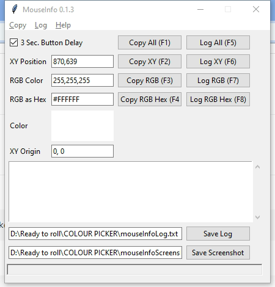

Python-MouseInfo-Colour-Picker
===
**A simple Colour Picker made with Python [MouseInfo](https://pypi.org/project/MouseInfo/) packedge.**

    

Made With
---

Installation
---
**With pip**:

    pip install -r requirements.txt && colour_picker.py   

**With Venv**

    python -m venv env && env\Scripts\activate.bat && pip install -r requirements.txt && cls && colour_picker.py

Download Exe
---
>**[vivekkushalch/Python-MouseInfo-Colour-Picker/releases](https://github.com/vivekkushalch/Python-MouseInfo-Colour-Picker/releases/)**

Usage
---
>run **[colour_picker.py](https://github.com/vivekkushalch/Python-MouseInfo-Colour-Picker/blob/main/colour_picker.py)**

Example
---
 

License 
-------
**The MIT License (MIT)**

A short and simple permissive license with conditions only requiring preservation of copyright and license notices. Licensed works, modifications, and larger works may be distributed under different terms and without source code.

-------
_Made with :heart: in India by [Vivek Kushal Chakraborty](https://github.com/vivekkushalch)._
